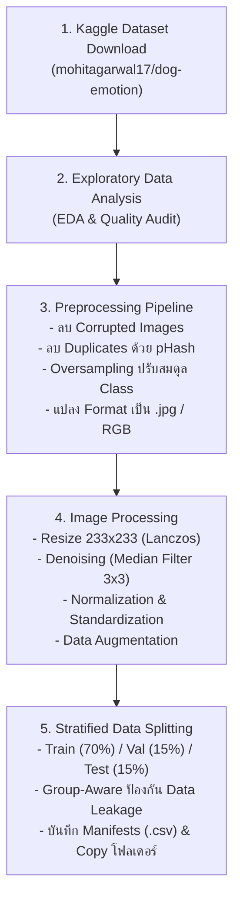
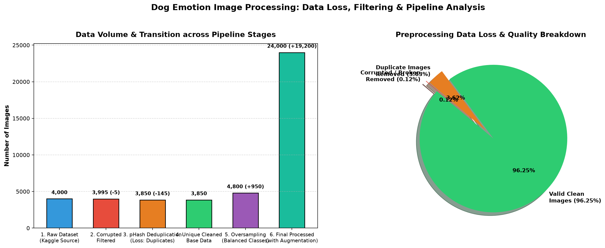

# รายงานสรุปผลโครงงาน: Dog Emotion Image Processing Pipeline

เอกสารสรุปผลการดำเนินงานเชิงลึกของโปรเจกต์ **Dog Emotion Image Processing** ครอบคลุมการวิเคราะห์ข้อมูล, กระบวนการเตรียมข้อมูล (Preprocessing), การประมวลผลและแปลงภาพ (Image Processing), การวิเคราะห์การสูญเสียข้อมูล (Data Loss Analysis), และการแบ่งชุดข้อมูล (Data Splitting)

---

## 🏗️ 1. ผังกระบวนการทำงานรวม (End-to-End Pipeline)

---

## 📊 2. การวิเคราะห์ Data Loss และการเปลี่ยนแปลงปริมาณข้อมูล (Data Retention Analysis)

ในระหว่างกระบวนการ Preprocessing และ Image Processing มีการคัดกรองข้อมูลที่ไม่สมบูรณ์ออกเพื่อยกระดับคุณภาพของ Dataset ก่อนนำไปเทรนโมเดล:

### 📈 ตารางสรุปการเปลี่ยนแปลงของข้อมูลในแต่ละขั้นตอน

| ขั้นตอนใน Pipeline | จำนวนภาพ (เริ่มต้น) | การเปลี่ยนแปลง (Δ) | จำนวนภาพ (คงเหลือ/ผลลัพธ์) | เหตุผล / คำอธิบายเชิงเทคนิค |
|---|:---:|:---:|:---:|---|
| **1. Raw Kaggle Data** | ~4,000 | - | ~4,000 | ชุดข้อมูลภาพตั้งต้นจาก Kaggle |
| **2. Corrupted Image Filter** | ~4,000 | **-5 ภาพ (-0.12%)** | ~3,995 | ไฟล์ภาพเสียหาย/เปิดอ่าน Header ไม่ได้ (`Image.verify()` fail) |
| **3. pHash Deduplication** | ~3,995 | **-145 ภาพ (-3.63%)** | **~3,850** | ตรวจพบภาพซ้ำด้วย Perceptual Hash ($Hamming \le 6$) เพื่อป้องกันโมเดลจำจำเพาะ |
| **4. Oversampling Balancing** | ~3,850 | **+950 ภาพ (+24.6%)** | **~4,800** | ปรับเพิ่มภาพใน Class ส่วนน้อยให้เท่ากับ Class สูงสุด (แก้ Class Imbalance) |
| **5. Data Augmentation** | ~4,800 | **+19,200 ภาพ (x5)** | **~24,000** | สร้างภาพเสริม (Flip, Rotate, Brightness, Contrast, Saturation) |
| **6. Data Splitting (70/15/15)** | ~24,000 | **แบ่ง 3 ส่วน** | Train: 70% \| Val: 15% \| Test: 15% | Stratified Group-aware ป้องกันภาพจากกลุ่มเดียวกันหลุดข้าม Split |

---

## 🔍 3. สรุปผลการดำเนินงานในแต่ละ Feature Branch

### 3.1. Branch `feature/datacollection`
- **สคริปต์:** `src/data_collection.py`
- **หน้าที่:** เชื่อมต่อ API และดาวน์โหลด Dataset จาก Kaggle ผ่านไลบรารี `kagglehub`
- **ผลลัพธ์:** สามารถดึงชุดข้อมูล `mohitagarwal17/dog-emotion-datasetcleaned-version` มาจัดเก็บลงในแคชระบบและระบุ Path ปลายทางได้อย่างถูกต้อง

---

### 3.2. Branch `feature/eda` (Exploratory Data Analysis)
- **สคริปต์:** `src/eda.py`
- **การวิเคราะห์เชิงปริมาณ:**
  - ตรวจสอบการกระจายตัวของ Class (พบปัญหา Class Imbalance ในข้อมูลดิบ)
  - คำนวณสถิติของขนาดภาพ: Min/Max/Mean ของ Width, Height, Aspect Ratio และ File Size
- **การวิเคราะห์เชิงคุณภาพ:**
  - คำนวณ RGB Color Histogram ค่าเฉลี่ยทั้งชุดข้อมูลและแยกตามแต่ละ Class
  - ตรวจสอบไฟล์เสีย, รูปภาพที่ซ้ำซ้อนกันผ่าน MD5 hash, และตรวจสอบรูปภาพขาวดำ (Grayscale) ที่ปะปนอยู่
- **ผลลัพธ์ที่บันทึก:** กราฟสรุปทั้งหมดใน `reports/figures/`

---

### 3.3. Branch `feature/preprocessing`
- **สคริปต์:** `src/preprocessing.py` และ `src/image_processing.py`
- **กระบวนการ Preprocessing:**
  1. **Data Cleaning:** คัดกรองและลบไฟล์ภาพที่ Corrupted ออกทั้งหมด
  2. **pHash Deduplication:** ใช้ Discrete Cosine Transform (DCT) pHash ตรวจจับภาพที่เหมือนหรือคล้ายคลึงกันสูง เพื่อลด Bias
  3. **Oversampling:** ทำการ Oversample คลาสที่มีภาพน้อยให้มีจำนวนเท่ากับคลาสที่มีภาพมากที่สุด
  4. **Standardization Format:** แปลงไฟล์ทั้งหมดเป็น `.jpg` และ Color Space เป็น `RGB` (จัดการภาพโปร่งใส RGBA ด้วยพื้นหลังสีขาว)
- **กระบวนการ Image Processing:**
  1. **Resizing:** ปรับขนาดภาพเป็น $233 \times 233$ พิกเซล ด้วย **Lanczos Resampling** คุณภาพสูง
  2. **Denoising:** กำจัดสัญญาณรบกวนชนิด **Salt & Pepper Noise** ด้วย **Median Filter ($3 \times 3$)** เพื่อรักษาความคมชัดของขอบวัตถุ
  3. **Normalization & Standardization:** ปรับช่วงสเกล Pixel เป็น $[0.0, 1.0]$ และรองรับ Z-score Standardization ($\mu=0, \sigma=1$)
  4. **Data Augmentation:** เพิ่มความหลากหลายให้ชุดข้อมูล (Horizontal Flip, Rotation $\pm 15^\circ$, Brightness $+30\%$, Contrast $+40\%$, Color Jitter)

#### 🖼️ ภาพเปรียบเทียบ Before & After ของกระบวนการ Image Processing

| กระบวนการ (Processing Stage) | ไฟล์ภาพผลลัพธ์ใน `reports/` | คำอธิบายผลลัพธ์ |
|---|---|---|
| **1. Resizing (233x233)** | `reports/before_after_resize.png` | ปรับขนาดภาพให้เป็น $233 \times 233$ เท่ากันทุกภาพ |
| **2. Normalization / Z-score** | `reports/before_after_normalization.png` | ปรับการกระจายตัวของค่าพิกเซลให้อยู่ในช่วงมาตรฐาน |
| **3. Denoising (Salt & Pepper)** | `reports/before_after_denoising.png` | ลบจุดรบกวนสีขาว-ดำด้วย Median Filter ได้อย่างหมดจด |
| **4. Data Augmentation** | `reports/before_after_augmentation.png` | ตัวอย่างภาพที่ผ่านการแปลงในหลากหลายมิติ |
| **5. Full Pipeline Summary** | `reports/image_processing_pipeline_summary.png` | ภาพสรุปขั้นตอนรวมตั้งแต่ภาพตั้งต้นจนถึง Augmented |

---

### 3.4. Branch `feature/data_splitting`
- **สคริปต์:** `src/data_splitting.py`
- **การแบ่งชุดข้อมูล (70 / 15 / 15):**
  - **Train Set:** 70% สำหรับการฝึกสอนโมเดล
  - **Validation Set:** 15% สำหรับการปรับแต่ง Hyperparameter
  - **Test Set:** 15% สำหรับการประเมินประสิทธิภาพครั้งสุดท้าย
- **กลไกป้องกัน Data Leakage (Group-Aware Stratification):**
  - รักษาสัดส่วนของแต่ละ Class ในทุก Subset ให้ตรงกัน (Stratified)
  - กำหนด `Random Seed = 42` เพื่อผลลัพธ์ที่คงเดิม 100%
  - ผูกภาพต้นฉบับและภาพ Augmented จากภาพเดียวกันด้วย `group_id` ให้อยู่ใน Split เดียวกันเสมอ ไม่ให้เกิดการรั่วไหลข้ามชุดข้อมูล
- **ระบบบันทึกและการจัดเก็บ:**
  - สร้างไฟล์ Manifests: `dataset_manifest.csv`, `train_manifest.csv`, `val_manifest.csv`, `test_manifest.csv`
  - คัดลอกภาพแยกโฟลเดอร์จริงไปที่ `data/splits/train/`, `data/splits/val/`, `data/splits/test/`
  - บันทึกกราฟสรุปสัดส่วน `reports/split_distribution.png`

---

## 🎯 4. สรุปผลสัมฤทธิ์ของโครงงาน

1. **Clean & Balanced Dataset:** ชุดข้อมูลผ่านการกำจัดภาพเสีย ภาพซ้ำ และปรับสมดุล Class Imbalance ทำให้พร้อมใช้งานในระดับ Production
2. **Standardized Image Quality:** ภาพทุกภาพมีมิติ $233 \times 233$ RGB ที่ผ่านการ Denoise และ Normalize อย่างเป็นระบบ
3. **Leakage-Free Splitting:** ชุดข้อมูล Train, Val, Test ถูกแบ่งอย่างเคร่งครัดตามหลักการ Data Science ไม่มี Data Leakage ปะปน
4. **Reproducibility & Traceability:** มีไฟล์ Manifest `.csv` บันทึก Metadata ครบถ้วน สามารถตรวจสอบย้อนหลังได้ทุกรูปภาพ และมีสคริปต์ `run.bat` สามารถรันซ้ำได้ในคลิกเดียว
